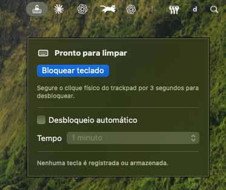

# LockKeyboard

Utilitário local para bloquear o teclado durante a limpeza do Mac. Requer macOS 13 ou posterior.

## Demonstração

Menu do LockKeyboard na barra de menus:



Notificação exibida enquanto o teclado está bloqueado:


## Projeto Xcode e app local

Abra `LockKeyboard.xcodeproj` no Xcode para inspecionar ou alterar o código.

## Baixar para testar

1. Baixe o arquivo [`LockKeyboard-macOS-arm64.zip`](LockKeyboard-macOS-arm64.zip) e abra-o para descompactar.
2. Dentro da pasta extraída, localize `LockKeyboard.app` e arraste **esse app** para `/Applications` (Aplicativos). Não arraste o ZIP.

Requer macOS 13 ou posterior em um Mac com Apple Silicon (M1 ou posterior). Esta build de teste é assinada ad-hoc, não é notarizada pela Apple; o macOS pode exibir um aviso de segurança na primeira abertura.

## Gerar o app

No Terminal:

```sh
cd "/caminho/para/LockKeyboard"
./build-app.sh
```

O script gera `LockKeyboard.app` nesta pasta. Arraste-o para `/Applications` para uso diário. O app é assinado localmente de forma ad-hoc; não exige publicação nem conta de desenvolvedor paga.

## Primeiro uso

1. Abra o app pelo Finder ou pela pasta `/Applications`.
2. Na barra de menus, escolha **Bloquear teclado**.
3. Na primeira vez, permita Acessibilidade para **LockKeyboard** em Ajustes do Sistema → Privacidade e Segurança → Acessibilidade. Feche e abra o app, se solicitado.
4. Para liberar, segure o clique físico do trackpad por 3 segundos. Também é possível usar **Desbloquear agora** no menu.

O desbloqueio automático pode ser ligado ou desligado no menu e configurado para 30 segundos, 1, 2, 5 ou 10 minutos. A preferência fica salva. Se o processo encerrar, o bloqueio do sistema também termina.

## Limites desta versão

- O desbloqueio usa clique mantido do trackpad; toque sem clicar não é detectável de forma confiável por API pública do macOS.
- Um mouse também pode acionar o desbloqueio se seu botão primário ficar pressionado por 3 segundos.
- Não bloqueia botão Power nem sensores Touch ID.
- O app não lê, registra nem armazena caracteres digitados.
